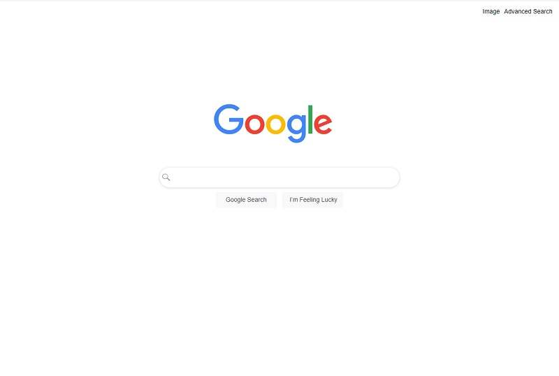

# Google Clone Project

## Overview
This project is a simplified clone of the Google search page created as part of the CS50's Web Programming with Python and JavaScript course offered by Harvard University. The primary objective of this project is to practice and demonstrate proficiency in HTML and CSS by replicating the basic layout and design of Google's homepage.

## Screenshot

## Live Project
You can view the live version of the project [here](https://pedrocristo.github.io/cs50sw-project-0/).

## Video
Watch the video version of the project here: [here](https://www.youtube.com/watch?v=qieANrhtXtw).

## Technologies Used
- **HTML5**: Used for structuring the webpage and its content.
- **CSS3**: Used for styling the webpage, including layout, colors, fonts, and responsiveness.
- **Git**: Version control system used to manage the project files.

## Features
- **Search Form**: A functional search input form styled to resemble the Google search form.
- **Navbar**: A navigation bar with links to other pages.
- **Responsive Layout**: The page is responsive and adapts to different screen sizes.
- **Custom Styling**: Includes custom styles for buttons, input fields, and layout.

## Pages
- **Google Search**:
  This is the main search page, styled to closely resemble Google's homepage. It features a search form where users can input queries, along with buttons for "Google Search" and "I'm Feeling Lucky". The layout includes a navigation bar with links to other sections of the site.

- **Google Images**:
  The Google Images page mimics the functionality of the Google Images search. Users can enter search queries to find images. The layout includes an image of the Google logo with an "Images" label, and the search bar is modified to include a hidden input field specifying image search.

- **Google Advanced Search**:
  The Advanced Search page allows users to perform more specific searches. It includes various input fields for narrowing down search results, such as "all these words," "this exact word or phrase," "any of these words," and "none of these words." There are also fields for specifying number ranges.

## Acknowledgements
This project was created as part of the CS50's Web Programming with Python and JavaScript course by Harvard University. The design is inspired by Google's homepage.

